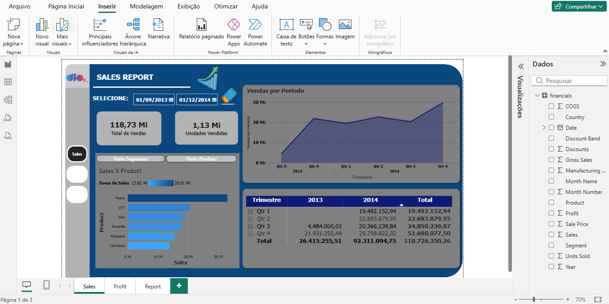
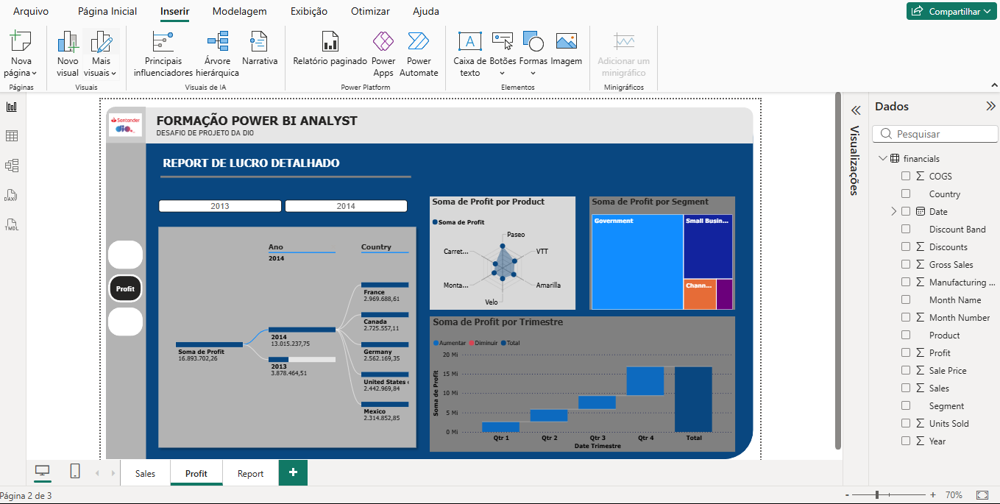
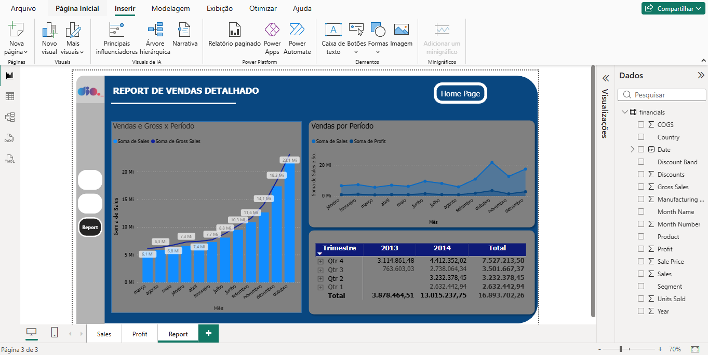

Desafio de Data Visualization & UX: Relatório Financeiro no Power BI

Este projeto teve como objetivo reformular um relatório financeiro no **Power BI**, aplicando princípios fundamentais de **User Experience (UX)** e **User Interface (UI)** para tornar a navegação intuitiva e a visualização de dados mais clara.

---

🎨 Princípios de Design Aplicados

1. Posicionamento e Hierarquia Visual**: Organização dos visuais respeitando a leitura natural da tela e a proporção dos elementos.
2. Contraste e Acessibilidade**: Ajuste de cores nos rótulos, eixos e fundos de gráficos para garantir boa leitura e contraste adequado.
3. Menu de Navegabilidade**: Criação de botões laterais interativos com efeitos de *hover* (focalizar) e seleção em todas as páginas.
4. Experiência do Usuário (UX)**: Inclusão de botões diretos de navegação e atalho para a página inicial (*Home Page*).

---

📊 Páginas do Relatório

Página 1: Visão Geral de Vendas (Sales)

Página 2: Análise de Lucro Detalhada (Profit)

Página 3: Relatório Consolidado de Vendas (Report)

